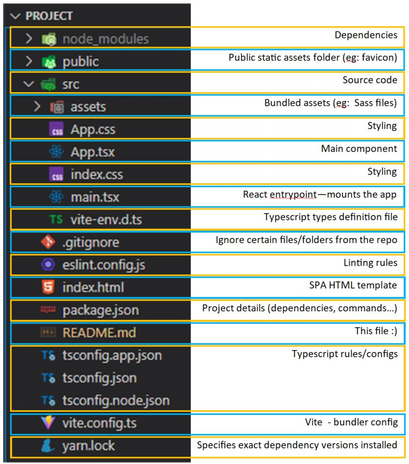

### **Session 1: React Basics**

**Pre-requirements:**
Have `node.js` v18+ and `yarn` installed:

- https://nodejs.org/en/download
- https://classic.yarnpkg.com/lang/en/docs/install/
- Check correct `yarn` installation by running `yarn --version`

**Steps:**

- Create your folder's project, eg: **react-workshop**
- Open a command line inside the previous created folder
- Run the following command to bootstrap React project with Vite, Typescript and SWC:
  - `yarn create vite . --template react-swc-ts`
  - `yarn add @picocss/pico`
- Install the project dependencies:
  - `yarn install` (running just `yarn` will yield the same result)
- Run `yarn dev` to run the development server
  - Open browser at the exposed path ( http://localhost:5173/ )

**Folder structure**



**Default project commands**

```json
  "scripts": {
    "dev": "vite", // yarn dev - starts development server with HMR, aka, live refresh
    "build": "tsc -b && vite build", // yarn build - transcompiles typescript and bundles with vite
    "lint": "eslint .", // yarn lint - checks for linting problems
    "preview": "vite preview" // yarn preview - runs the previously build; NOT A PRODUCTION SERVER
  }
```

**Steps:**

- Delete `App.css` and `index.css`
- Replace the line `import './index.css'` from `main.tsx` file with:
  - `import '@picocss/pico/css/pico.min.css';`
- Remove the contents of `App.tsx` file with:

  - ```jsx
    function App() {
      return (
        <main className='container'>
          <h1>Contacts Manager</h1>
        </main>
      );
    }

    export default App;
    ```

- Change document title in the `index.html` file:
  - `<title>React Workshop - Contacts Manager</title>`
