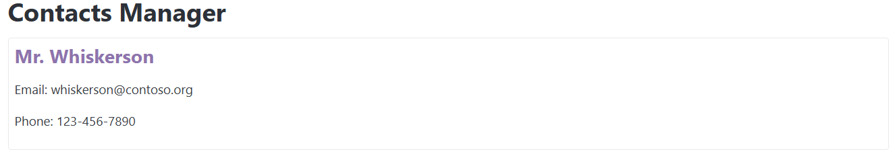

### **Session 2: Components and JSX**

**Pre-requirements:**
Have `node.js` v18+ and `yarn` installed:

- https://nodejs.org/en/download
- https://classic.yarnpkg.com/lang/en/docs/install/
- Check correct `yarn` installation by running `yarn --version`

Have completed [Session 1](SESSION1.md)

**Steps:**

- Create a `<root>/src/ContactCard.jsx` component (not **.tsx** as we don't want to be bother with Typscript yet)

```jsx
// ContactCard.js
import React from 'react';

const ContactCard = () => {
  const name = 'Mr. Whiskerson';
  const email = 'whiskerson@contoso.org';
  const phone = '123-456-7890';
  return (
    <div>
      <h3>{name}</h3>
      <p>Email: {email}</p>
      <p>Phone: {phone}</p>
    </div>
  );
};

export default ContactCard;
```

- Import the component in **App.tsx**
  - We need to add the import declaration, and a special Typescript comment to ignore the error

```tsx
//@ts-expect-error we know that we are using jsx
import ContactCard from './ContactCard.jsx'; // <---- Importing the component we created previous

function App() {
  return (
    <main className='container'>
      <h1>Contacts Manager</h1>
      <ContactCard /> {/* <---- Now e can use the component */}
      {/* Also, Hi👋 I'm a JSX comment! */}
    </main>
  );
}

export default App;
```

- We can modify the `ContactCard.jsx` and add some styles:

```jsx
// ContactCard.jsx
import React from 'react';

const ContactCard = () => {
  const name = 'Mr. Whiskerson';
  const email = 'whiskerson@contoso.org';
  const phone = '123-456-7890';

  // We create an object with the styles (kebab-case becomes camelCase)
  const styles = {
    border: '1px solid #eaeaea',
    backgroundColor: 'rgba(255 255 255 / 0.1)',
    borderRadius: '5px',
    padding: '10px',
    margin: '10px 0',
  };

  return (
    // and we pass that dynamic property to the inline style attribute of the div
    <div style={styles}>
      <h3>{name}</h3>
      <p>Email: {email}</p>
      <p>Phone: {phone}</p>
    </div>
  );
};

export default ContactCard;
```

- Styles can also be provided via css file:
  - Create a `styles.css`:

```css
/* styles.css */
.person-name {
  font-size: 1.5rem;
  font-weight: bold;
  color: #8e73ad;
}
```

- Import the css file, and use the class in the `ContactCard.jsx` component:

```jsx
// ContactCard.jsx
import React from 'react';
//import css styles
import './styles.css';

const ContactCard = () => {
  const name = 'Mr. Whiskerson';
  const email = 'whiskerson@contoso.org';
  const phone = '123-456-7890';

  // We create an object with the styles (kebab-case becomes camelCase)
  const styles = {
    border: '1px solid #eaeaea',
    backgroundColor: 'rgba(255 255 255 / 0.1)',
    borderRadius: '5px',
    padding: '10px',
    margin: '10px 0',
  };

  return (
    // and we pass that dynamic property to the inline style attribute of the div
    <div style={styles}>
      <h3 className='person-name'>{name}</h3> {/* We use the class name here */}
      <p>Email: {email}</p>
      <p>Phone: {phone}</p>
    </div>
  );
};

export default ContactCard;
```

**Final result:**
By the end of today's session, the app should look like this:
(DARK MODE)

(LIGHT MODE)

