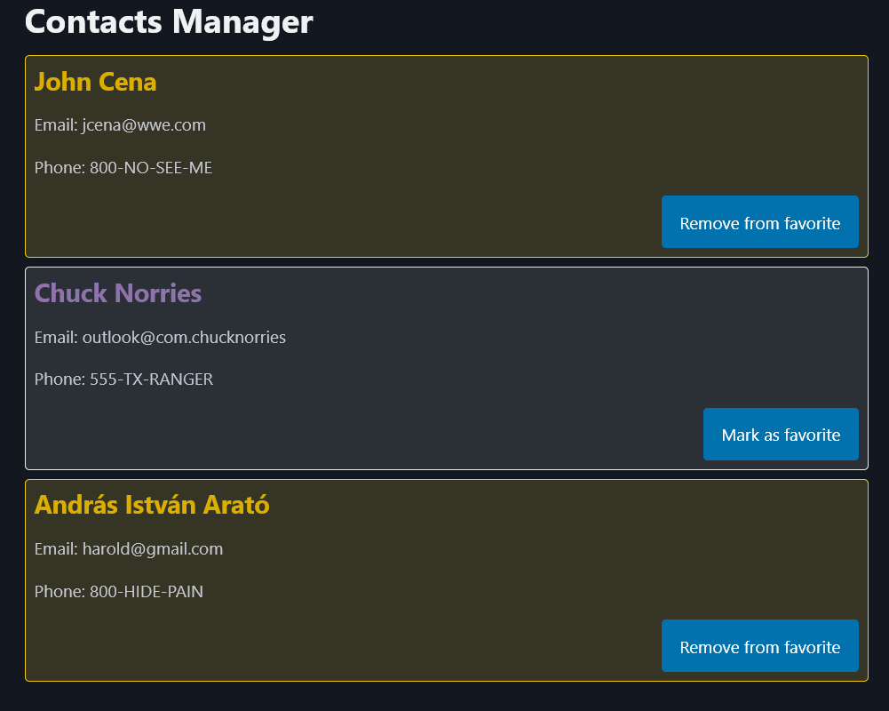

### **Session 2: Components and JSX**

**Pre-requirements:**
Have `node.js` v18+ and `yarn` installed:

- https://nodejs.org/en/download
- https://classic.yarnpkg.com/lang/en/docs/install/
- Check correct `yarn` installation by running `yarn --version`

Have completed previous sessions [#1](SESSION1.md) [#2](SESSION2.md)
Have **React Devtools** browser extension installed: [Chrome-based](https://chromewebstore.google.com/detail/react-developer-tools/fmkadmapgofadopljbjfkapdkoienihi) | [Firefox](https://addons.mozilla.org/en-US/firefox/addon/react-devtools/)

---

#### Props practice

**Steps:**

- Modify the `ContactCard.jsx` to get the contact data via props:

```jsx
// ContactCard.jsx
import React from 'react';
//import css styles
import './styles.css';

// props are passed to a React component as the first argument of the function
const ContactCard = (props) => {
  // We create an object with the styles (kebab-case becomes camelCase)
  const styles = {
    border: '1px solid #eaeaea',
    backgroundColor: 'rgba(255 255 255 / 0.1)',
    borderRadius: '5px',
    padding: '10px',
    margin: '10px 0',
  };

  return (
    // and we pass that dynamic property to the inline style attribute of the div
    <div style={styles}>
      <h3 className='person-name'>{props.name}</h3>{' '}
      {/* We use the class name here */}
      <p>Email: {props.email}</p>
      <p>Phone: {props.phone}</p>
    </div>
  );
};

export default ContactCard;
```

- And now we need to pass that data via attributes, for that let's chage our `App.tsx`:

```jsx
//@ts-expect-error we know that we are using jsx
import ContactCard from './ContactCard.jsx'; // <---- Importing the component we created previous

function App() {
  return (
    <main className='container'>
      <h1>Contacts Manager</h1>

      {/* we pass data via the attributes (aka, props) of our component */}
      <ContactCard
        name='John Cena'
        email='jcena@wwe.com'
        phone='800-NO-SEE-ME'
      />
      {/* <---- Now e can use the component */}
      {/* Also, Hi👋 I'm a JSX comment! */}
    </main>
  );
}

export default App;
```

- We can display more contact cards by just referencing the component multiple times with different props:

```jsx
//@ts-expect-error we know that we are using jsx
import ContactCard from './ContactCard.jsx'; // <---- Importing the component we created previous

function App() {
  return (
    <main className='container'>
      <h1>Contacts Manager</h1>

      {/* we pass data via the attributes (aka, props) of our component */}
      <ContactCard
        name='John Cena'
        email='jcena@wwe.com'
        phone='800-NO-SEE-ME'
      />
      {/* we can create multiple instances of the component with different props*/}
      <ContactCard
        name='Chuck Norries'
        email='outlook@com.chucknorries'
        phone='555-TX-RANGER'
      />
      <ContactCard
        name='András István Arató'
        email='harold@gmail.com'
        phone='800-HIDE-PAIN'
      />
      {/* <---- Now e can use the component */}
      {/* Also, Hi👋 I'm a JSX comment! */}
    </main>
  );
}

export default App;
```

#### State & Events practice

**Steps:**

- Let's add a button on `ContactCard.jsx` that allow us to mark a contact as favourite:
```jsx
// ContactCard.jsx
import React from 'react';
//import css styles
import './styles.css';

// props are passed to a React component as the first argument of the function
const ContactCard = (props) => {
  // We create an object with the styles (kebab-case becomes camelCase)
  const styles = {
    border: '1px solid #eaeaea',
    backgroundColor: 'rgba(255 255 255 / 0.1)',
    borderRadius: '5px',
    padding: '10px',
    margin: '10px 0',
  };

  return (
    // and we pass that dynamic property to the inline style attribute of the div
    <div style={styles}>
      <h3 className='person-name'>{props.name}</h3>{' '}
      {/* We use the class name here */}
      <p>Email: {props.email}</p>
      <p>Phone: {props.phone}</p>
      
      {/* create this wrapping div so we can align the button to the right */}
      <div style={{ display: 'flex', justifyContent: 'end' }}>
        <button>Mark as favorite</button> {/* We add a button */}
      </div>
    </div>
  );
};

export default ContactCard;
```

- Create a state that allows us to track if said contact is been marked as favorite:
```jsx
// ContactCard.jsx

const ContactCard = (props) => {
  const [isFavorite, setIsFavorite] = React.useState(false); // the state that tracks if the contact is a favorite

```
- Lets use that state to add dynamic style to favorited contact cards: (we can use the React DevTools to simulate)
```jsx

  // Styles for when a contact is a favorite
  const favoriteStyles = {
    backgroundColor: 'rgba(255, 222, 73, 0.15)',
    border: '1px solid #f0c711'
  };

  const cardStyles = isFavorite ? { ...styles, ...favoriteStyles } : styles; // we merge the styles based on the isFavorite state

  return (
    // and we pass that dynamic property to the inline style attribute of the div
    <div style={cardStyles}>
```

- Finally, lets connect the button click action with the state setter:
```jsx
// ContactCard.jsx
import React from 'react';
//import css styles
import './styles.css';

// props are passed to a React component as the first argument of the function
const ContactCard = (props) => {
  const [isFavorite, setIsFavorite] = React.useState(false); // the state that tracks if the contact is a favorite

  const handleFavorite = () => {
    setIsFavorite(!isFavorite); // toggle the state
  }

  // We create an object with the styles (kebab-case becomes camelCase)
  const styles = {
    border: '1px solid #eaeaea',
    backgroundColor: 'rgba(255 255 255 / 0.1)',
    borderRadius: '5px',
    padding: '10px',
    margin: '10px 0',
  };

  // Styles for when a contact is a favorite
  const favoriteStyles = {
    backgroundColor: 'rgba(255, 222, 73, 0.15)',
    border: '1px solid #f0c711'
  };

  const cardStyles = isFavorite ? { ...styles, ...favoriteStyles } : styles; // we merge the styles based on the isFavorite state

  return (
    // and we pass that dynamic property to the inline style attribute of the div
    <div style={cardStyles}>
      <h3 className='person-name'>{props.name}</h3>{' '}
      {/* We use the class name here */}
      <p>Email: {props.email}</p>
      <p>Phone: {props.phone}</p>
      
      {/* create this wrapping div so we can align the button to the right */}
      <div style={{ display: 'flex', justifyContent: 'end' }}>
        {/* link the onClick with the handleFavorite method */}
        <button onClick={handleFavorite}>Mark as favorite</button> {/* We add a button */}
      </div>
    </div>
  );
};

export default ContactCard;
```

- React is versatile, we can also make dynamic styles based on classNames:
  - add this on `styles.css`:
```css
.person-name {
  font-size: 1.5rem;
  font-weight: bold;
  color: #8e73ad;
}

.favorite {
  color: #dbae00;
}
```

  - and change this on the `ContactCard.jsx`:
```jsx
// ContactCard.jsx
import React from 'react';
//import css styles
import './styles.css';

// props are passed to a React component as the first argument of the function
const ContactCard = (props) => {
  const [isFavorite, setIsFavorite] = React.useState(false); // the state that tracks if the contact is a favorite

  const handleFavorite = () => {
    setIsFavorite(!isFavorite); // toggle the state
  }

  // We create an object with the styles (kebab-case becomes camelCase)
  const styles = {
    border: '1px solid #eaeaea',
    backgroundColor: 'rgba(255 255 255 / 0.1)',
    borderRadius: '5px',
    padding: '10px',
    margin: '10px 0',
  };

  // Styles for when a contact is a favorite
  const favoriteStyles = {
    backgroundColor: 'rgba(255, 222, 73, 0.15)',
    border: '1px solid #f0c711'
  };

  const cardStyles = isFavorite ? { ...styles, ...favoriteStyles } : styles; // we merge the styles based on the isFavorite state
  const personNameClasses = isFavorite ? 'person-name favorite' : 'person-name'; // we create a dynamic class name based on the isFavorite state

  return (
    // and we pass that dynamic property to the inline style attribute of the div
    <div style={cardStyles}>
      <h3 className={personNameClasses}>{props.name}</h3> {/* We use the variable here */}
      {/* We use the class name here */}
      <p>Email: {props.email}</p>
      <p>Phone: {props.phone}</p>
      
      {/* create this wrapping div so we can align the button to the right */}
      <div style={{ display: 'flex', justifyContent: 'end' }}>
        {/* link the onClick with the handleFavorite method */}
        <button onClick={handleFavorite}>Mark as favorite</button> {/* We add a button */}
      </div>
    </div>
  );
};

export default ContactCard;
```
---

**Final result:**
