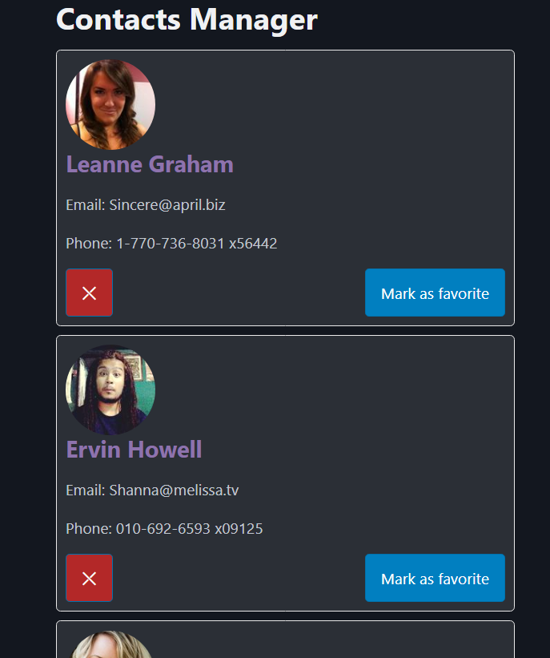

### **Session 4: Lifecycle vs Hooks, Lists, Keys, and Conditional Rendering**

**Pre-requirements:**
Have `node.js` v18+ and `yarn` installed:

- https://nodejs.org/en/download
- https://classic.yarnpkg.com/lang/en/docs/install/
- Check correct `yarn` installation by running `yarn --version`

Have completed previous sessions [#1](SESSION1.md) [#2](SESSION2.md) [#3](SESSION3.md) [#4](SESSION4.md)
Have **React Devtools** browser extension installed: [Chrome-based](https://chromewebstore.google.com/detail/react-developer-tools/fmkadmapgofadopljbjfkapdkoienihi) | [Firefox](https://addons.mozilla.org/en-US/firefox/addon/react-devtools/)

---

#### Practice

**Steps:**

- Extract logic out of `App.tsx` into a new component `ContactList.jsx`:
```jsx
// ContactList.jsx
import {useEffect, useMemo, useState} from 'react';
import ContactCard from './ContactCard';

export default function ContactList() {
 {/* we define the setter function */}
 const [contacts, setContacts] = useState(null);
 const [refetchContacts, setRefetchContacts] = useState(false);

 // Use useEffect to load the data on component mount
 useEffect(() => {
   const fetchContacts = async () => {
     const data = await fetch('https://jsonplaceholder.typicode.com/users').then((res) => res.json());
     setContacts(data);
     setRefetchContacts(false);
   };

   fetchContacts();
 }, [refetchContacts]); // Empty dependency array ensures this runs only once after the initial render

 const contactsWithPhotos = useMemo(() => { // Use useMemo to memoize the contacts with photos, so it doesn't recalculate on every render
   if (!contacts) return null;

   return contacts.map((contact) => {
     const gender = contact.id % 2 === 0 ? 'men' : 'women';
     return {...contact, photo: `https://randomuser.me/api/portraits/${gender}/${contact.id}.jpg`};
   }
   );
 }, [contacts]); // Recalculate only when contacts change

 // Define the function to remove a contact
 const handleRemove = (email) => {
   // we'll use the email as the unique identifier for the contact
   setContacts((prevContacts) => prevContacts.filter((c) => c.email !== email));
 }	

 return (
   <div>    
     {// Let's validate if there are contacts to display
      (!contacts?.length || !contactsWithPhotos?.length) && (<>
       <p>No contacts found (yet!)</p>
       <button onClick={() => setRefetchContacts(true)}>Try again</button>
      </>)
     }

     {contactsWithPhotos?.map((contact) => (  // Nullish coalescing operator to prevent errors when contacts is null: https://developer.mozilla.org/en-US/docs/Web/JavaScript/Reference/Operators/Nullish_coalescing
       <ContactCard
         key={contact.id} /* don't forget the key, so react properly keeps track of mutation that require rerender */
         name={contact.name}
         email={contact.email}
         phone={contact.phone}
         photo={contact.photo} // we need to consume this new prop in the ContactCar.jsx to display the photo
         onRemove={handleRemove} // we need to consume this new prop in the ContactCar.jsx to remove the contact
       />
     ))}
   </div>
 );
}
```
- Leaving the `App.tsx` like so:
```jsx
// App.tsx
// @ts-expect-error shoosh
import ContactList from './ContactList.jsx';

function App() {
  
  return (
    <main className='container'>
      <h1>Contacts Manager</h1>
      
      <ContactList />
    </main>
  );
}

export default App;
```

- And now we can start creating our styled components:
  - Install `styled-components` package:
    - `yarn add styled-components`
  - Create a file `styles.jsx`:
```jsx
// styles.jsx
import styled from 'styled-components';

// copy styles from ContactCard.jsx
export const StyledContactCard = styled.div`
  border: 1px solid #eaeaea;
  background-color: rgba(255 255 255 / 0.1);
  border-radius: 5px;
  padding: 10px;
  margin: 10px 0;
`;
```

- And using it on the `ContactCard.jsx` component:
```jsx
// ContactCard.jsx
import React from 'react';
//import css styles
import './styles.css';
import { StyledContactCard } from './styles'; // import the styled component

// props are passed to a React component as the first argument of the function
const ContactCard = (props) => {
  const [isFavorite, setIsFavorite] = React.useState(false); // the state that tracks if the contact is a favorite

  const handleFavorite = () => {
    setIsFavorite(!isFavorite); // toggle the state
  }

  const handleRemove = () => {
    props.onRemove(props.email); // call the onRemove function passed as a prop with the email of the contact
  }

  // We create an object with the styles (kebab-case becomes camelCase)
  const styles = {
    border: '1px solid #eaeaea',
    backgroundColor: 'rgba(255 255 255 / 0.1)',
    borderRadius: '5px',
    padding: '10px',
    margin: '10px 0',
  };

  // Styles for when a contact is a favorite
  const favoriteStyles = {
    backgroundColor: 'rgba(255, 222, 73, 0.15)',
    border: '1px solid #f0c711'
  };

  const cardStyles = isFavorite ? { ...styles, ...favoriteStyles } : styles; // we merge the styles based on the isFavorite state
  const personNameClasses = isFavorite ? 'person-name favorite' : 'person-name'; // we create a dynamic class name based on the isFavorite state

  return (
    <StyledContactCard> {/* We use the styled component here */}
      

      <h3 className={personNameClasses}>{props.name}</h3> {/* We use the variable here */}
      {/* We use the class name here */}
      <p>Email: {props.email}</p>
      <p>Phone: {props.phone}</p>
      
      {/* create this wrapping div so we can align the button to the right */}
      <div style={{ display: 'flex', justifyContent: 'space-between' }}> {/* Change the alignment between the buttons */}
        <button onClick={handleRemove} className='secondary'>❌</button> {/* the remove button */}

        {/* link the onClick with the handleFavorite method */}
        <button onClick={handleFavorite}>{isFavorite ? 'Remove from' : 'Mark as'} favorite</button>  {/* We add a button */}
      </div>
    </StyledContactCard>
  );
};

export default ContactCard;
```

- But now we lost the dynamic styles applied when a contact is marked as a favorite, let's fix that:
  - First we pass the **isFavorite** state to the styled component:
  ```jsx
    <StyledContactCard $isFavorite={isFavorite}> {/* We use the styled component here */}
  ```
  - Then we handle the dynamic styles in the `StyledContactCard` definition:
  ```jsx
  // styles.jsx
  import styled from 'styled-components';

  // copy styles from ContactCard.jsx
  export const StyledContactCard = styled.div`
    border: 1px solid #eaeaea;
    background-color: rgba(255, 255, 255, 0.1);
    border-radius: 5px;
    padding: 10px;
    margin: 10px 0;

    ${(props) => props.$isFavorite && `
      background-color: rgba(255, 222, 73, 0.15);
      border: 1px solid #f0c711
    `} // reuse the favoriteStyles here
  `;
  ```

  - Now we can remove those old unused dynamic styles from the `ContactCard.jsx`:
  ```jsx
  // ContactCard.jsx
  import React from 'react';
  //import css styles
  import './styles.css';
  import { StyledContactCard } from './styles'; // import the styled component

  // props are passed to a React component as the first argument of the function
  const ContactCard = (props) => {
    const [isFavorite, setIsFavorite] = React.useState(false); // the state that tracks if the contact is a favorite

    const handleFavorite = () => {
      setIsFavorite(!isFavorite); // toggle the state
    }

    const handleRemove = () => {
      props.onRemove(props.email); // call the onRemove function passed as a prop with the email of the contact
    }

    const personNameClasses = isFavorite ? 'person-name favorite' : 'person-name'; // we create a dynamic class name based on the isFavorite state

    return (
      <StyledContactCard $isFavorite={isFavorite}> {/* We use the styled component here */}
        

        <h3 className={personNameClasses}>{props.name}</h3> {/* We use the variable here */}
        {/* We use the class name here */}
        <p>Email: {props.email}</p>
        <p>Phone: {props.phone}</p>
        
        {/* create this wrapping div so we can align the button to the right */}
        <div style={{ display: 'flex', justifyContent: 'space-between' }}> {/* Change the alignment between the buttons */}
          <button onClick={handleRemove} className='secondary'>❌</button> {/* the remove button */}

          {/* link the onClick with the handleFavorite method */}
          <button onClick={handleFavorite}>{isFavorite ? 'Remove from' : 'Mark as'} favorite</button>  {/* We add a button */}
        </div>
      </StyledContactCard>
    );
  };

  export default ContactCard;
  ```

- Lets move the styles from the css into a styled-component:
```jsx
// styles.jsx
import styled from 'styled-components';

// copy styles from ContactCard.jsx
export const StyledContactCard = styled.div`
  border: 1px solid #eaeaea;
  background-color: rgba(255, 255, 255, 0.1);
  border-radius: 5px;
  padding: 10px;
  margin: 10px 0;

  ${(props) => props.$isFavorite && `
    background-color: rgba(255, 222, 73, 0.15);
    border: 1px solid #f0c711
  `} // reuse the favoriteStyles here
`;

export const StyledContactName = styled.h3`
  font-size: 1.5rem;
  font-weight: bold;
  color: #8e73ad;

  ${(props) => props.$isFavorite && `
    color: #f0c711;
  `}
`;
```

- And then we change the `ContactCard.jsx` to use it
```jsx
// ContactCard.jsx
import React from 'react';
import { StyledContactCard, StyledContactName } from './styles'; // import the styled component

// props are passed to a React component as the first argument of the function
const ContactCard = (props) => {
  const [isFavorite, setIsFavorite] = React.useState(false); // the state that tracks if the contact is a favorite

  const handleFavorite = () => {
    setIsFavorite(!isFavorite); // toggle the state
  }

  const handleRemove = () => {
    props.onRemove(props.email); // call the onRemove function passed as a prop with the email of the contact
  }

  return (
    <StyledContactCard $isFavorite={isFavorite}> {/* We use the styled component here */}
      

      <StyledContactName $isFavorite={isFavorite}>{props.name}</StyledContactName> {/* We use the variable here */}
      {/* We use the class name here */}
      <p>Email: {props.email}</p>
      <p>Phone: {props.phone}</p>
      
      {/* create this wrapping div so we can align the button to the right */}
      <div style={{ display: 'flex', justifyContent: 'space-between' }}> {/* Change the alignment between the buttons */}
        <button onClick={handleRemove} className='secondary'>❌</button> {/* the remove button */}

        {/* link the onClick with the handleFavorite method */}
        <button onClick={handleFavorite}>{isFavorite ? 'Remove from' : 'Mark as'} favorite</button>  {/* We add a button */}
      </div>
    </StyledContactCard>
  );
};

export default ContactCard;
```
- And finally, we can remove the `styles.css`

- Lets create an avatar styled-component:
```jsx
//styles.jsx
export const StyledAvatar = styled.img`
  width: 100px;
  ${(props) => props.$isRound && `
    border-radius: 50%;
  `}  
`;
```
- And replace the **
```

- We can also create a footer and a custom delete button:
```jsx 
//styles.jsx
export const StyledFooter = styled.div`
  display: flex;
  justify-content: space-between;
`;

// variant to color
const colorVariants = {
  primary: '#017fc0',
  secondary: '#484f8d',
  danger: '#b32828',
};
export const StyledButton = styled.button`
  background-color:
    ${(props) => colorVariants[props.$variant] || colorVariants.primary};
  color: white;
`;
```

- And change the `ContactCard` to:
```jsx
// ContactCard.jsx
import React from 'react';
import { StyledAvatar, StyledButton, StyledContactCard, StyledContactName, StyledFooter } from './styles'; // import the styled component

// props are passed to a React component as the first argument of the function
const ContactCard = (props) => {
  const [isFavorite, setIsFavorite] = React.useState(false); // the state that tracks if the contact is a favorite

  const handleFavorite = () => {
    setIsFavorite(!isFavorite); // toggle the state
  }

  const handleRemove = () => {
    props.onRemove(props.email); // call the onRemove function passed as a prop with the email of the contact
  }

  return (
    <StyledContactCard $isFavorite={isFavorite}> {/* We use the styled component here */}
      <StyledAvatar src={props.photo} alt={props.name} $isRound />

      <StyledContactName $isFavorite={isFavorite}>{props.name}</StyledContactName> {/* We use the variable here */}

      <p>Email: {props.email}</p>
      <p>Phone: {props.phone}</p>
      
      {/* create this wrapping div so we can align the button to the right */}
      <StyledFooter>
        <StyledButton
          onClick={handleRemove}
          $variant="danger"
        >
          ⛌
        </StyledButton> {/* the remove button */}

        {/* link the onClick with the handleFavorite method */}
        <StyledButton
          onClick={handleFavorite}
          $variant={isFavorite ? 'secondary' : 'primary'}
        >
          {isFavorite ? 'Remove from' : 'Mark as'} favorite
        </StyledButton>  {/* We add a button */}
      </StyledFooter>
    </StyledContactCard>
  );
};

export default ContactCard;
```


---

# Final result:

