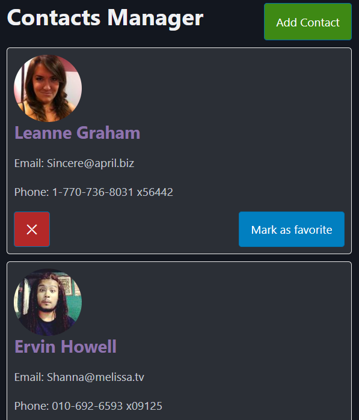

### **Session 5: Forms & Controlled Components**

**Pre-requirements:**
Have `node.js` v18+ and `yarn` installed:

- https://nodejs.org/en/download
- https://classic.yarnpkg.com/lang/en/docs/install/
- Check correct `yarn` installation by running `yarn --version`

Have completed previous sessions [#1](SESSION1.md) [#2](SESSION2.md) [#3](SESSION3.md) [#4](SESSION4.md) [#5](SESSION5.md)
Have **React Devtools** browser extension installed: [Chrome-based](https://chromewebstore.google.com/detail/react-developer-tools/fmkadmapgofadopljbjfkapdkoienihi) | [Firefox](https://addons.mozilla.org/en-US/firefox/addon/react-devtools/)

---

#### Practice

**Steps:**
- Start by adding a new button to `App.tsx`:
```jsx
// App.tsx
/* eslint-disable @typescript-eslint/ban-ts-comment */
// @ts-nocheck
import ContactList from './ContactList.jsx';
import { StyledButton, StyledRow } from './styles';

function App() {
  
  return (
    <main className='container'>
      <StyledRow>
        <h1>Contacts Manager</h1>
        <StyledButton $variant="success">Add contact</StyledButton>
      </StyledRow>
      
      <ContactList />
    </main>
  );
}

export default App;
```
- and then extend our styles to include the **StyledRow** and the new button variant color:
```jsx
// styles.jsx
// variant to color
const colorVariants = {
  primary: '#017fc0',
  secondary: '#484f8d',
  danger: '#b32828',
  success: '#3e8914',
};
export const StyledButton = styled.button`
  background-color:
    ${(props) => colorVariants[props.$variant] || colorVariants.primary};
  color: white;
`;

export const StyledRow = styled.div`
margin-top: 10px;
  display: flex;
  justify-content: space-between;
`;
```

- Now we create a new component for the form editor `ContactForm.jsx`:
```jsx
// ContactForm.jsx
export default function ContactForm() {
    return (
        <div>
            <h1>Contact Form</h1>
        </div>
    )
}
```

- Now we need to being able to call the form when clicking in the **Add contact** button, so we change `App.tsx`:
```jsx
// App.tsx
/* eslint-disable @typescript-eslint/ban-ts-comment */
// @ts-nocheck
import ContactList from './ContactList.jsx';
import { StyledButton, StyledRow } from './styles';
import { useState } from 'react';
import ContactForm from './ContactForm.jsx';

function App() {
  const [showForm, setShowForm] = useState(false);

  return (
    <main className='container'>
      <StyledRow>
        <h1>Contacts Manager</h1>
        <StyledButton
          $variant="success"
          onClick={() => setShowForm(!showForm)}
        >
          {showForm ? 'Show Contacts' : 'Add Contact'}
        </StyledButton>
      </StyledRow>
      
      {showForm ? 
        <ContactForm /> :
        <ContactList />
      }
    </main>
  );
}

export default App;
```

- Now we can start by creating the actual form: 
```jsx
// ContactForm.jsx

import { StyledFormContainer, StyledFormRow } from './styles';
import { useState } from 'react';

export default function ContactForm() {
  const currId = crypto.getRandomValues(new Uint32Array(1)).at(0);
  const [formData, setFormData] = useState({
    name: '',
    email: '',
    phone: '',
    photo: `https://picsum.photos/seed/${currId}/200/300`,
    id: currId,
  });

  return (
    <StyledFormContainer>
      <StyledFormRow>ID: {formData.id}</StyledFormRow>
      <StyledFormRow>Name: {formData.name}</StyledFormRow>
      <StyledFormRow>Email: {formData.email}</StyledFormRow>
      <StyledFormRow>Phone: {formData.phone}</StyledFormRow>
    </StyledFormContainer>
  );
}
```
- and the styles:
```jsx
export const StyledFormContainer = styled(StyledContactCard).attrs({ as : 'form' })`
  padding: 20px;
`;

export const StyledFormRow = styled.div`
  margin-bottom: 5px;
`;
```

- Lets bind the state to form inputs - aka, 2 way binding:
```jsx
// ContactForm.jsx

import { StyledFormContainer, StyledFormRow } from './styles';
import { useState } from 'react';

export default function ContactForm() {
  const currId = crypto.getRandomValues(new Uint32Array(1)).at(0);
  const [formData, setFormData] = useState({
    name: '',
    email: '',
    phone: '',
    photo: `https://picsum.photos/seed/${currId}/100/100`,
    id: currId,
  });

  const handleChange = (e) => {
    const { name, value } = e.target;
    setFormData({
      ...formData,
      [name]: value,
    });
  };

  return (
    <StyledFormContainer>
      <StyledFormRow>ID: {formData.id}</StyledFormRow>

      <StyledFormRow>
        <label htmlFor="name">Name:</label>
        <input
          type="text"
          id="name"
          name="name"
          value={formData.name}
          onInput={handleChange}
        />
      </StyledFormRow>
      <StyledFormRow>
        <label htmlFor="email">Email:</label>
        <input
          type="email"
          id="email"
          name="email"
          value={formData.email}
          onInput={handleChange}
        />
      </StyledFormRow>
      <StyledFormRow>
        <label htmlFor="phone">Phone:</label>
        <input
          type="tel"
          id="phone"
          name="phone"
          value={formData.phone}
          onInput={handleChange}
        />
      </StyledFormRow>
      <StyledFormRow>
        Photo: 
      </StyledFormRow>
    </StyledFormContainer>
  );
}
```
- But now we have an issue. We need to save our form and add the record to contacts list, here's how we can solve:
  - Extract contact list state into a hook, let's create a  `useContactData.js`:
  ```jsx
  // useContactData.js
  import { useState, useEffect, useMemo } from 'react';

  export default function useContactData() {
    const [contacts, setContacts] = useState(null);
    const [refetchContacts, setRefetchContacts] = useState(false);

    useEffect(() => {
      if(!refetchContacts) return; // Let's not auto fetch on mount, rather on-demand

      const fetchContacts = async () => {
        const data = await fetch('https://jsonplaceholder.typicode.com/users').then((res) => res.json());
        setContacts(data);
        setRefetchContacts(false);
      };

      fetchContacts();
    }, [refetchContacts]);

    const contactsWithPhotos = useMemo(() => {
      if (!contacts) return null;

      return contacts.map((contact) => {
        const gender = contact.id % 2 === 0 ? 'men' : 'women';
        return { ...contact, photo: `https://randomuser.me/api/portraits/${gender}/${contact.id}.jpg` };
      });
    }, [contacts]);

    const handleRemove = (email) => {
      setContacts((prevContacts) => prevContacts.filter((c) => c.email !== email));
    };

    return {
      contacts: contactsWithPhotos,
      handleRemove,
      refetchContacts: () => setRefetchContacts(true),
      isLoading: contacts === null, // Add loading state
    };
  }
  ```
  - Since we now don't do the initial fetch on mount, we need to invoke it on the `App.tsx`:
  ```jsx
  // App.tsx
  /* eslint-disable @typescript-eslint/ban-ts-comment */
  // @ts-nocheck
  import ContactList from './ContactList.jsx';
  import { StyledButton, StyledRow } from './styles';
  import { useState, useEffect } from 'react';
  import ContactForm from './ContactForm.jsx';
  import useContactData from './useContactData';

  function App() {
    const [showForm, setShowForm] = useState(false);
    const contactDataHook = useContactData();

    useEffect(() => {
    if(!contactDataHook.contacts?.length){
      contactDataHook.refetchContacts();
    }
    }, [contactDataHook, contactDataHook.contacts]);

    return (
      <main className='container'>

        <StyledRow>
          <h1>Contacts Manager</h1>
          <StyledButton
            $variant="success"
            onClick={() => setShowForm(!showForm)}
          >
            {showForm ? 'Show Contacts' : 'Add Contact'}
          </StyledButton>
        </StyledRow>
        
        {showForm ? 
          <ContactForm /> :
          <ContactList contactDataHook={contactDataHook}/>
        }
      </main>
    );
  }

  export default App;

  ```
  - And now that we extracted the logic from the `ContactList` component, it can be simplified:
  ```jsx
  // ContactList.jsx
  import ContactCard from './ContactCard';

  export default function ContactList(props) {
    const { contacts, handleRemove, refetchContacts } = props.contactDataHook;

  return (
    <div>    
        {(!contacts?.length) && (
          <>
            <p>No contacts found (yet!)</p>
            <button onClick={() => refetchContacts()}>Try again</button>
          </>
        )}

      {contacts?.map((contact) => (  // Nullish coalescing operator to prevent errors when contacts is null: https://developer.mozilla.org/en-US/docs/Web/JavaScript/Reference/Operators/Nullish_coalescing
        <ContactCard
          key={contact.id} /* don't forget the key, so react properly keeps track of mutation that require rerender */
          name={contact.name}
          email={contact.email}
          phone={contact.phone}
          photo={contact.photo} // we need to consume this new prop in the ContactCar.jsx to display the photo
          onRemove={handleRemove} // we need to consume this new prop in the ContactCar.jsx to remove the contact
        />
      ))}
    </div>
  );
  }
  ```

- Now, back to our form, we can add a save button, that submits the form:
```jsx
// ContactForm.jsx

import { StyledFormContainer, StyledFormRow, StyledFooter } from './styles';
import { useState } from 'react';

export default function ContactForm() {
  const currId = crypto.getRandomValues(new Uint32Array(1)).at(0);
  const [formData, setFormData] = useState({
    name: '',
    email: '',
    phone: '',
    photo: `https://picsum.photos/seed/${currId}/100/100`,
    id: currId,
  });

  const handleChange = (e) => {
    const { name, value } = e.target;
    setFormData({
      ...formData,
      [name]: value,
    });
  };

  const handleSubmit = (event) => {
    event.preventDefault();
    console.log(`submited! ${JSON.stringify(formData)}`);
  }

  return (
    <StyledFormContainer onSubmit={handleSubmit}>
      <StyledFormRow>ID: {formData.id}</StyledFormRow>

      <StyledFormRow>
        <label htmlFor="name">Name:</label>
        <input
          type="text"
          id="name"
          name="name"
          value={formData.name}
          onInput={handleChange}
        />
      </StyledFormRow>
      <StyledFormRow>
        <label htmlFor="email">Email:</label>
        <input
          type="email"
          id="email"
          name="email"
          value={formData.email}
          onInput={handleChange}
        />
      </StyledFormRow>
      <StyledFormRow>
        <label htmlFor="phone">Phone:</label>
        <input
          type="tel"
          id="phone"
          name="phone"
          value={formData.phone}
          onInput={handleChange}
        />
      </StyledFormRow>
      <StyledFormRow>
        Photo: 
      </StyledFormRow>
      <hr />
      <StyledFormRow>
        <button type='submit'>Save</button>
      </StyledFormRow>
    </StyledFormContainer>
  );
}
```

- lets extend the `useContactData` hook to allow adding contacts:
```jsx
  const contactsWithPhotos = useMemo(() => {
    if (!contacts) return null;

    return contacts.map((contact) => {
      const gender = contact.id % 2 === 0 ? 'men' : 'women';
      return { photo: `https://randomuser.me/api/portraits/${gender}/${contact.id}.jpg`, ...contact }; // reverse the order so we dont overwrite
    });
  }, [contacts]);

  const handleRemove = (email) => {
    setContacts((prevContacts) => prevContacts.filter((c) => c.email !== email));
  };

  // Add a function to add a contact
  const addContact = (contact) => {
    setContacts((prevContacts) => [...prevContacts, contact]);
  }

  return {
    contacts: contactsWithPhotos,
    handleRemove,
    refetchContacts: () => setRefetchContacts(true),
    isLoading: contacts === null, // Add loading state
    addContact, // return the function to add a contact
  };
```

- so now we can use it on the `ContactForm`:
```jsx
  const handleSubmit = (event) => {
    event.preventDefault();
    props.contactDataHook.addContact(formData);
  }
```
- Don't forget to pass the hook instance on the `App.tsx`
```jsx
      {showForm ? 
        <ContactForm contactDataHook={contactDataHook}/> :
        <ContactList contactDataHook={contactDataHook}/>
      }
```

- Lets redirect the user, by calling a onSubmit event (`ContactForm.jsx`):
```jsx
  const handleSubmit = (event) => {
    event.preventDefault();
    props.contactDataHook.addContact(formData);
    props.onSubmit();
  }
```

---

# Final result:

