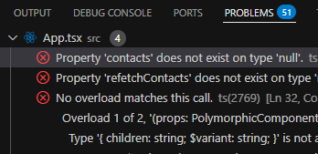

### **Session 9: TypeScript, Linting, RTL and Storybook**

**Pre-requirements:**
Have `node.js` v18+ and `yarn` installed:

- https://nodejs.org/en/download
- https://classic.yarnpkg.com/lang/en/docs/install/
- Check correct `yarn` installation by running `yarn --version`

Have completed previous sessions [#1](SESSION1.md) [#2](SESSION2.md) [#3](SESSION3.md) [#4](SESSION4.md) [#5](SESSION5.md) [#6](SESSION6.md) [#7](SESSION7.md) [#8](SESSION8.md)

Have **React Devtools** browser extension installed: [Chrome-based](https://chromewebstore.google.com/detail/react-developer-tools/fmkadmapgofadopljbjfkapdkoienihi) | [Firefox](https://addons.mozilla.org/en-US/firefox/addon/react-devtools/)

---

#### Practice

Goals:
- Make project Typescript compliant
- Fix all Eslint issues
- Install and Create a RTL Jest unit test
- Install and Create a Storybook

**Steps:**

- To make our React code Typescript, we need to rename all file extensions from `.js|.jsx` to `.ts|.tsx`

- Next we comments that disabled lint rules, and then we start the fun!

- Lets start the fixing:
  - `styles.tsx`
  ```tsx
  // styles.ts
  import styled from 'styled-components';

  // copy styles from ContactCard.jsx
  export const StyledContactCard = styled.div<{ $isFavorite?: boolean }>`
    border: 1px solid #eaeaea;
    background-color: rgba(255, 255, 255, 0.1);
    border-radius: 5px;
    padding: 10px;
    margin: 10px 0;

    ${(props) => props.$isFavorite && `
      background-color: rgba(255, 222, 73, 0.15);
      border: 1px solid #f0c711
    `} // reuse the favoriteStyles here
  `;

  export const StyledContactName = styled.h3<{ $isFavorite?: boolean }>`
    font-size: 1.5rem;
    font-weight: bold;
    color: #8e73ad;

    ${(props) => props.$isFavorite && `
      color: #f0c711;
    `}
  `;

  export const StyledAvatar = styled.img<{ $isFavorite?: boolean, $isRound?: boolean }>`
    width: 100px;
    ${(props) => props.$isRound && `
      border-radius: 50%;
    `}  
  `;

  export const StyledFooter = styled.div`
    display: flex;
    justify-content: space-between;
  `;

  // variant to color
  const colorVariants = {
    primary: '#017fc0',
    secondary: '#484f8d',
    danger: '#b32828',
    success: '#3e8914',
  };
  export const StyledButton = styled.button<{ $variant?: keyof typeof colorVariants }>`
    background-color:
      ${(props) => colorVariants[props.$variant || 'primary']};
    color: white;
  `;

  export const StyledRow = styled.div`
  margin-top: 10px;
    display: flex;
    justify-content: space-between;
  `;

  export const StyledFormContainer = styled(StyledContactCard).attrs({ as : 'form' })`
    padding: 20px;
  `;

  export const StyledFormRow = styled.div`
    margin-bottom: 5px;
  `;  
  ```

  - next, lets take care of our custom hook, `useContactData.tsx`
  ```jsx
  // useContactData.tsx
  import { createContext, useContext, useState, useEffect, useMemo } from 'react';

  export type ContactProviderProps = {
    children: React.ReactNode;
  };

  export type Contact = {
    id: number;
    name: string;
    email: string;
    phone: string;
    photo?: string;
  };


  type ContactContextType = {
    contacts: Contact[] | null; 
    handleRemove: (email: string) => void;
    refetchContacts: () => void;
    isLoading: boolean;
    addContact: (contact: Contact) => void;
    updateContact: (contact: Contact) => void;
  };

  const ContactContext = createContext<ContactContextType>({} as ContactContextType);

  export function ContactProvider({ children } : ContactProviderProps) {
    const [contacts, setContacts] = useState<Contact[]>([]);
    const [refetchContacts, setRefetchContacts] = useState(false);

    useEffect(() => {
      if (!refetchContacts) return;

      const fetchContacts = async () => {
        const data = await fetch('https://jsonplaceholder.typicode.com/users').then((res) => res.json());
        setContacts(data);
        setRefetchContacts(false);
      };

      fetchContacts();
    }, [refetchContacts]);

    const contactsWithPhotos = useMemo(() => {
      if (!contacts) return null;

      return contacts.map((contact) => {
        const gender = contact.id % 2 === 0 ? 'men' : 'women';
        return { photo: `https://randomuser.me/api/portraits/${gender}/${contact.id}.jpg`, ...contact };
      });
    }, [contacts]);

    const handleRemove = (email: string) => {
      setContacts((prevContacts) => prevContacts.filter((c) => c.email !== email));
    };

    const addContact = (contact: Contact) => {
      setContacts((prevContacts) => [...prevContacts, contact]);
    };

    const updateContact = (contact: Contact) => {
      setContacts((prevContacts) => prevContacts.map((c) => (c.id === contact.id ? contact : c)));
    };

    return (
      <ContactContext.Provider value={{
        contacts: contactsWithPhotos,
        handleRemove,
        refetchContacts: () => setRefetchContacts(true),
        isLoading: contacts === null,
        addContact,
        updateContact, // <------------------- Dont forget to export
      }}>
        {children}
      </ContactContext.Provider>
    );
  }

  export function useContacts() {
    return useContext(ContactContext);
  }
  
  ```